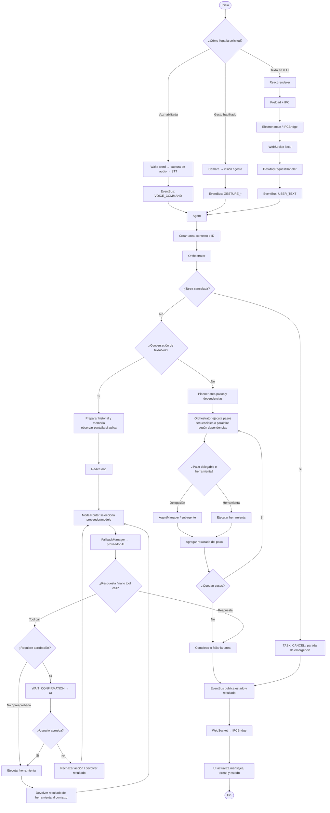
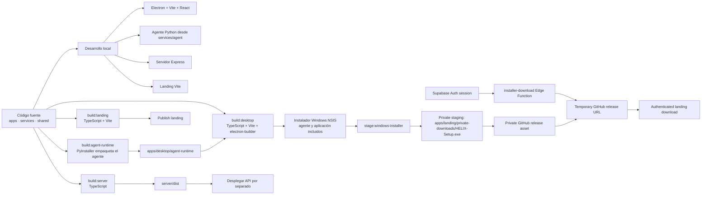

# Diagrama de flujo completo del proyecto HELIX

Este documento resume los componentes presentes en el repositorio, cómo se
comunican y cómo se construye la aplicación. El agente de escritorio funciona
localmente; el servidor Express es un servicio HTTP independiente y no forma
parte del canal local Electron-WebSocket-Python.

## Arquitectura completa

```mermaid
flowchart LR
    subgraph Personas
        USER[Usuario de Windows]
        WEBUSER[Visitante web]
    end

    subgraph Desktop["Aplicación de escritorio — apps/desktop"]
        UI["React renderer<br/>Floating UI · Toolbox · Task Manager"]
        PRELOAD["Preload<br/>API allowlist con contextBridge"]
        MAIN["Electron main<br/>ventanas · bandeja · atajos · ciclo de vida"]
        IPC["IPCBridge<br/>IPC UI ↔ main y WebSocket"]
        PYMAN["PythonManager<br/>inicia / detiene el agente"]
        SETTINGS["Configuración local<br/>settings.json"]
        MAIN --> PYMAN
        MAIN --> SETTINGS
    end

    subgraph Agent["Agente local — services/agent"]
        WS["WebSocket local<br/>127.0.0.1:8765"]
        REQUESTS["DesktopRequestHandler<br/>comandos, consultas y ajustes"]
        EVENTS["EventBus"]
        AGENT["Agent<br/>entrada de texto / voz"]
        TASKS["TaskManager + StateManager"]
        ORCH["Orchestrator"]
        PLANNER["Planner<br/>plan y dependencias"]
        REACT["ReActLoop<br/>razonamiento y llamadas a herramientas"]
        AGENTS["AgentManager / subagentes"]
        CONTEXT["ContextManager + RoleConfig"]
        MEMORY["MemoryManager"]
        ROUTER["ModelRouter + CapabilityRegistry"]
        FALLBACK["FallbackManager"]
        KEYS["KeyManager + ProviderRegistry"]
        PROVIDERS["OpenAI · Anthropic · Google<br/>proveedores compatibles"]
        TOOLS["ToolRegistry<br/>sistema · archivos · navegador · documentos"]
        SECURITY["PermissionManager<br/>aprobaciones / rechazos"]
        SKILLS["Skills<br/>SkillLoader · IntentMatcher · SkillRegistry"]
        PLUGINS["PluginManager"]
        MCP["MCP<br/>cliente · servidor · puente de herramientas"]
        PERCEPTION["Percepción opcional<br/>wake word · voz/STT/TTS · cámara/gestos · pantalla/OCR"]
        BROWSER["Browser automation<br/>BrowserAgent · BrowserSession · web research"]
        OS["Windows / sistema operativo<br/>apps · ventanas · teclado · mouse · shell"]

        WS --> REQUESTS --> EVENTS
        EVENTS --> AGENT
        AGENT --> TASKS
        AGENT --> ORCH
        ORCH --> PLANNER
        ORCH --> REACT
        ORCH --> AGENTS
        ORCH <--> MEMORY
        REACT <--> CONTEXT
        REACT --> ROUTER --> FALLBACK --> KEYS --> PROVIDERS
        REACT --> TOOLS
        TOOLS --> SECURITY
        SECURITY -->|Aprobado| OS
        SECURITY -->|Aprobado| BROWSER
        SECURITY -->|Esperar confirmación| EVENTS
        SKILLS --> TOOLS
        SKILLS --> PLANNER
        PLUGINS --> TOOLS
        PLUGINS --> SKILLS
        MCP --> TOOLS
        PERCEPTION --> EVENTS
        AGENT --> EVENTS
        TASKS --> EVENTS
        ORCH --> EVENTS
        REACT --> EVENTS
        ROUTER --> EVENTS
    end

    subgraph Web["Landing — apps/landing"]
        LANDING["React + Vite<br/>inicio · login · registro · descarga"]
        AUTH["Supabase Auth"]
        INSTALLER["Descarga del instalador<br/>HELIX-Setup.exe"]
        LANDING --> AUTH
        LANDING --> INSTALLER
    end

    subgraph API["API independiente — server"]
        EXPRESS["Express API<br/>Helmet · CORS · rate limit · logging"]
        ROUTES["Rutas REST<br/>health · auth · settings · tasks · models"]
        MIDDLEWARE["Validación Zod<br/>JWT / autenticación · errores"]
        PRISMA["Prisma"]
        DB["Base de datos configurada<br/>PostgreSQL / Supabase"]
        EXPRESS --> ROUTES --> MIDDLEWARE --> PRISMA --> DB
    end

    USER --> UI
    USER --> PERCEPTION
    UI <-->|API expuesta| PRELOAD
    PRELOAD <-->|IPC seguro| MAIN
    MAIN <-->|WebSocket local| IPC
    IPC <-->|WebSocket local| WS
    PYMAN -->|inicia el proceso| WS
    EVENTS -->|eventos: tareas · mensajes · estado · aprobación| WS
    TOOLS -->|acciones / observación| OS
    OS -->|resultados| TOOLS
    WEBUSER --> LANDING
    APICLIENT["Cliente HTTP autenticado<br/>integración independiente"] --> EXPRESS

    subgraph Shared["Contratos compartidos — shared"]
        TYPES["Tipos y constantes TypeScript"]
    end
    TYPES -. contratos .-> UI
    TYPES -. contratos .-> EXPRESS
```

### Límites entre componentes

- El renderer no accede directamente a Node.js: el preload expone una API
  explícita y Electron main valida y enruta IPC.
- Electron inicia el agente Python (incluido en el instalador o desde el árbol
  de fuentes durante desarrollo) y se conecta a su WebSocket local.
- La API Express mantiene sus propias rutas, autenticación y persistencia.
  El diagrama no presupone que el renderer de escritorio o la landing invoquen
  esas rutas: esa integración debe existir en el cliente que las consuma.
- La voz y la cámara dependen de ajustes y recursos locales; son capacidades
  opcionales. Las llamadas a modelos requieren credenciales configuradas.

## Flujo de una solicitud y ejecución de herramientas

## Flujo de desarrollo y distribución

Comando de producción para Windows: `npm run build:windows`. Este ejecuta la
construcción del runtime Python, la app de escritorio, el copiado del
instalador a la landing y la compilación de la landing. La API se construye y
se despliega por separado con `npm run build:server`.

## Mapa de carpetas

| Ruta | Responsabilidad |
| --- | --- |
| `apps/desktop/electron` | Ciclo de vida Electron, ventanas, bandeja, IPC y gestión del proceso Python |
| `apps/desktop/renderer` | Interfaz React: conversación, tareas, controles y ajustes |
| `apps/desktop/agent-runtime` | Artefactos del agente Python empaquetado |
| `apps/landing` | Sitio web, autenticación Supabase y descarga del instalador |
| `server/src` | API Express, middleware, rutas, validación y manejo de errores |
| `server/prisma` | Esquema y configuración del acceso a datos |
| `services/agent/core` | Agente, planificación, orquestación, tareas, contexto y eventos |
| `services/agent/ai` | Proveedores, selección de modelos, capacidades y fallback |
| `services/agent/tools` | Acciones disponibles para el agente |
| `services/agent/perception` | Voz, visión, captura de pantalla, OCR y gestos |
| `services/agent/browser` | Automatización y búsqueda web |
| `services/agent/security` | Control de permisos |
| `services/agent/memory`, `skills`, `plugins`, `mcp` | Memoria y extensiones de capacidades |
| `shared` | Tipos y constantes TypeScript compartidos |
| `scripts` | Configuración, compilación del runtime y preparación del instalador |
| `docs` | Documentación de configuración y arquitectura |
